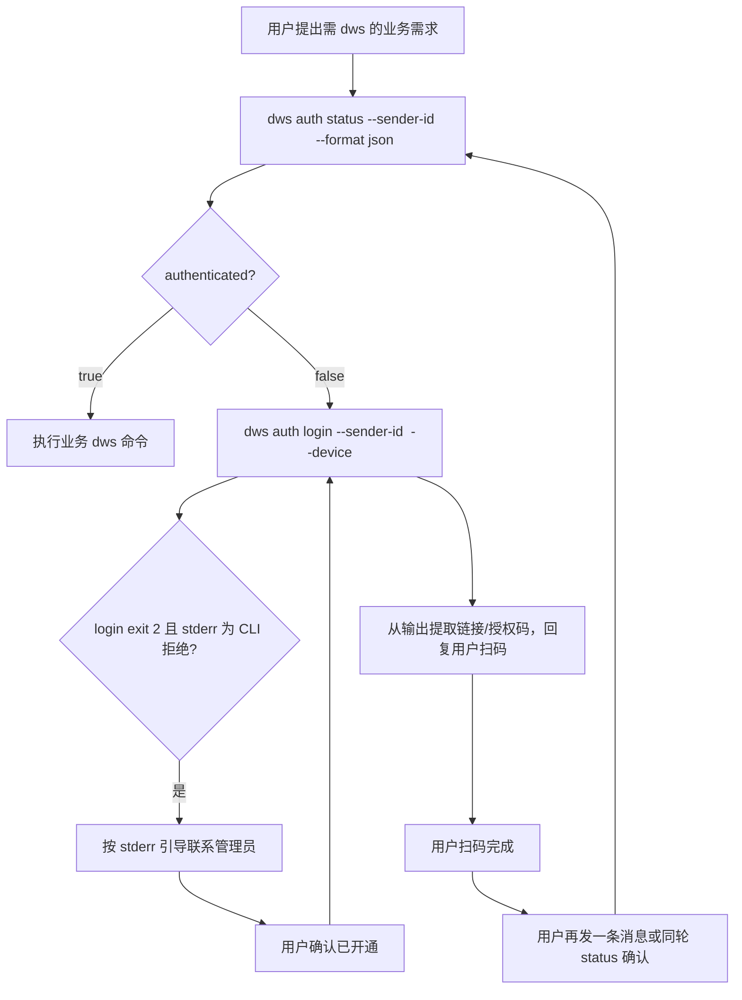

# DWS Auth 工作流（dws skill 唯一编排源）

> **归属：** dws 仓库 skill（本文件）。connector 与其它 Skill **只引用、不复制**。  
> **命令规范的唯一说明处：** 下文「命令规范」+ 工作流步骤。

## 命令规范（统一说明）

> 速查表见 [global-reference.md](./global-reference.md)「认证」；本节为完整规范与工作流。

dws 历史上存在两套 login 写法，**在 OpenClaw 钉钉场景下只保留一种标准形式**。

| 命令 | OpenClaw 钉钉 | 说明 |
|------|---------------|------|
| `dws auth login --sender-id <id> --device` | ✅ **唯一标准** | token 写入 `~/.dws/users/<id>/`；服务器无头环境必须用 `--device` |
| `dws auth status --sender-id <id> --format json` | ✅ **唯一标准** | 检查该聊天用户是否已落盘 |
| `dws auth login` | ❌ **废弃（Agent 禁止）** | loopback 流，网关服务器不可用；且易与 default token 混淆 |
| `dws auth login --device`（无 `--sender-id`） | ❌ **Agent 禁止** | 仅运维一次性初始化 dingmbw 时由人 SSH 执行（default → `~/.dws/`），**不是**聊天用户授权 |
| `dws auth status`（无 `--sender-id`） | ❌ **Agent 禁止** | 查的是 default 身份，与当前聊天用户无关 |

**`<id>` 取值：** OpenClaw 钉钉场景下取 prompt 中 `[DingTalk DWS Context]` 的 `DWS_AUTH_IDENTITY`（与 env 同值）。  
**必须显式写 `--sender-id`：** 不要依赖「env 已注入所以可省略」——子进程 env 可能不一致，显式 flag 才可靠。

**两套 token 目录为何并存（合理，但 Agent 只走 per-sender）：**

```
~/.dws/                     ← default（运维初始化 dingmbw 应用凭证，非聊天用户业务 token）
~/.dws/users/<senderId>/    ← 每个钉钉用户各一份（IM 业务唯一来源）
```

业务命令在设了 `DWS_AUTH_IDENTITY` 时 **fail-closed**：`users/<id>/` 无 token 则报 `IDENTITY_NOT_AUTHENTICATED`，**不会**偷用 `~/.dws/` 的 default token。

**Agent 默认口令（全文统一）：**

```bash
dws auth status --sender-id <DWS_AUTH_IDENTITY> --format json
dws auth login --sender-id <DWS_AUTH_IDENTITY> --device
```

## OpenClaw 集成分工

| 角色 | 职责 |
|------|------|
| **dingtalk-connector** | 消息通道；dispatch 时设置 `DWS_AUTH_IDENTITY`；prompt 注入 `[DingTalk DWS Context]`（**不**代为 login） |
| **dws CLI** | `auth login` / `auth status` / token 落盘；Step4 CLI 校验；stderr 输出中文拒绝说明 |
| **Agent** | 按本工作流执行；将授权链接/说明回复给用户 |

## 固定工作流



## 步骤说明

### 0. 身份

- 使用 `[DingTalk DWS Context]` 中的 `DWS_AUTH_IDENTITY` 作为 `--sender-id`
- **禁止**使用部署者或其他用户的 token

### 1. 检查状态

```bash
dws auth status --sender-id <senderId> --format json
```

`authenticated: true` → 直接执行业务。

### 2. 发起登录

```bash
dws auth login --sender-id <senderId> --device
```

- 从 stdout/stderr 提取 **授权链接** 与 **授权码**，在回复中发给用户
- login 可能阻塞至扫码完成（最长约 15 分钟）；`exec` 超时可设足够长，或先提取链接回复用户、下条消息再 `status`
- **禁止** `kill` / `pkill` 正在进行的 login 进程
- **禁止** 并行对同一 `senderId` 多次 spawn login；若已有进行中 login，等待或复用输出中的链接

### 3. CLI 拒绝（Step4）

login 失败且 exit code 为 `2` 时，阅读 stderr 中文说明（token **未落盘**）：

| 典型 stderr | Agent 引导 |
|-------------|-----------|
| 不在 CLI 授权人员范围 | 联系管理员加入 CLI 授权名单 |
| 尚未开启 CLI 数据访问权限 | 联系管理员开启组织 CLI |
| 禁止所有成员使用 CLI | 组织策略禁止，联系管理员 |
| 其它 | 引用 stderr 原文，勿猜测 |

用户确认已开通后，从步骤 1 重新执行。

### 4. 执行业务

token 落盘后再执行 `dws calendar` / `dws doc` 等；命令加 `--format json`。

### 5. 常见错误（非登录）

| 现象 | 处理 |
|------|------|
| `IDENTITY_NOT_AUTHENTICATED` | token 未落盘，走步骤 1–2，勿猜 CLI 名单 |
| `IDENTITY_MISMATCH` | 提示用户**本人**扫码，重新 login |
| `AUTH_TOKEN_EXPIRED` | 重新 `dws auth login --sender-id <id> --device` |
| HTTP 403 / scope 不足 | 权限问题，联系管理员，勿反复 login |

## 禁止事项

- **禁止** Agent 使用裸 `dws auth login` 或省略 `--sender-id` / `--device` 的变体（见「命令规范」）
- 不要假设 connector 会代为 login 或推链
- 不要在未 `authenticated` 时用 `--verbose` 反复重试业务命令
- 不要将 HTTP 403 当作登录问题

## CLI 契约

login exit code 与 stderr 说明见 [dws-auth-contract.md](./dws-auth-contract.md)。
